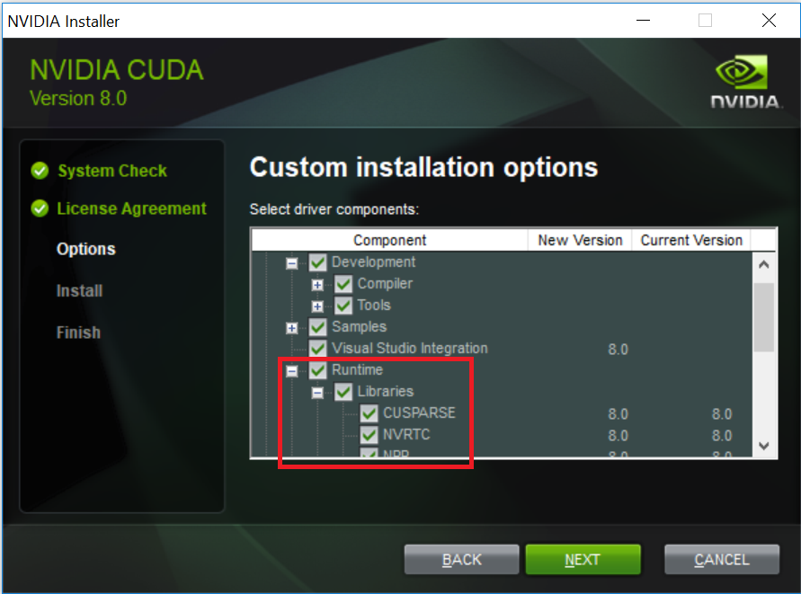

# 准备开发环境

开始在本地或远程计算机上训练深度学习模型之前，需要确保安装了最新的必要软件。 如果有NVIDIA GPU，也包括它最新的驱动和软件库。 还要确保安装了Python和必要的Python库，包括NumPy，SciPy，Python的Visual Studio/Visual Studio Code支持，以及相应的深度学习框架，例如，微软认知工具包(CNTK)，TensorFlow, Caffe2, MXNet, Keras, Theano, PyTorch和Chainer。

> [!注意]
> 
> 以下章节的软件介绍摘录于其主页。

## NVIDIA GPU驱动，CUDA和cuDNN

### NVIDIA GPU驱动

NVIDIA GPU让深度学习框架能够较快而又精确的完成学习，使其达到让人工智能能够实际应用的程度。 如果你的计算机有NVIDIA显卡，请访问[这里](http://www.nvidia.com/Download/index.aspx)或通过操作系统更新来安装最新的驱动。

### CUDA

[CUDA](https://developer.nvidia.com/cuda-zone)是NVIDIA发布的并行计算平台及编程模型。 它能够利用显卡的强大计算能力来大幅加速计算性能。 现在，深度学习框架需要至少安装CUDA Toolkit 8.0。

安装CUDA

- 访问[网站](https://developer.nvidia.com/cuda-80-ga2-download-archive)，下载并安装CUDA。
- 确保安装了CUDA的动态链接库，并将CUDA库的路径增加到 %PATH% 或 $PATH 环境变量中。
- 在Windows上，默认路径为"C:\Program Files\NVIDIA GPU Computing Toolkit\CUDA\v8.0\bin"。



### cuDNN

[cuDNN](https://developer.nvidia.com/cudnn) (CUDA深度神经网络库) 是NVIDIA发布的用于GPU加速的深度神经网络软件库。 最新的深度学习框架需要cuDNN v6。

安装cuDNN

- 访问[这里](https://developer.nvidia.com/rdp/cudnn-download)来下载并安装最新软件包。
- 确保cuDDN可执行文件的路径包含在了 %PATH% 或 $PATH 环境变量中。
- Windows上，可以将 cudnn64_6.dll 复制到 "C:\Program Files\NVIDIA GPU Computing Toolkit\CUDA\v8.0\bin"。

> [!注意]
> 
> 早期版本的深度学习框架，如CNTK 2.0 和 TensorFlow 1.2.1需要 cuDNN v5.1。 可以同时安装cuDDN的多个版本。

## Python

Python已经成为了深度学习应用的主要编程语言。 **64位**Python版本是必须的，推荐使用最新的[Python 3.5](https://www.python.org/downloads/release/python-354/)来获得最好的兼容性。

请将 Python 目录添加到 %PATH% 或 $PATH 环境变量中。 还需要安装**pip**包管理系统来安装和管理Python软件包。 深度学习框架依赖于pip来进行安装。

> [!注意]
> 
> 1. 在WIndows上，最好只为个人账户安装Python程序。
> 2. 如果Python软件包安装在了系统目录中（例如，Visual Studio 2017中的版本），则在运行pip时，需要管理权限才能安装Python软件包。


接下来，验证一下Python是否安装正确了，并将pip升级到最新版本。 在Python 3.5安装后，请在终端中执行以下命令：

- **Windows**

```cmd
C:\>python -V
Python 3.5.4

C:\>pip3 -V
pip 9.0.3 from c:\users\test\appdata\local\programs\python\python35\lib\site-packages (python 3.5)

C:\>python -m pip install -U pip
```

- **macOS**

```bash
MyMac:~ test$ python3 -V
Python 3.5.4

MyMac:~ test$ pip3 -V
pip 9.0.3 from /Library/Frameworks/Python.framework/Versions/3.5/lib/python3.5/site-packages (python 3.5)

MyMac:~ test$ python3 -m pip install -U pip
```

- **Linux**

```bash
test@MyLinux:~$ python3 -V
Python 3.5.4

test@MyLinux:~$ pip3 -V
pip 9.0.3 from /usr/local/lib/python3.5/dist-packages (python 3.5)

test@MyLinux:~$ sudo python3 -m pip install -U pip
```

## 在Windows上使用Visual Studio中安装的Python

Visual Studio通过Python开发和数据科学组件（仅Visual Studio 2017）和免费的Visual Studio的Python工具扩展（Visual Studio 2015和早期版本），为Python语言提供[开源](https://github.com/Microsoft/ptvs)支持。 进一步了解，请访问[在Visual Studio中使用Python](https://docs.microsoft.com/en-us/visualstudio/python/python-in-visual-studio)。

### Visual Studio 2017

在Visual Studio 2017安装开始时，请选择**Python开发**负载来安装Python语言支持。

注意，64位的Python3.6将自动安装。 如果已经安装了Python 3.5，请参考接下来的"设置默认Python环境"章节。


### Visual Studio 2015

当安装Visual Studio 2015时，请选择**自定义**类型，并选择**Visual Studio Python工具**。


### 设置默认Python环境

如果存在多个Python环境，用户需要为Visual Studio的AI项目设置默认的Python环境。 例如，用户手动安装了Python 3.5，而Visual Studio 2017 Python开发负载自动安装了64位的Python 3.6。 或者用户创建了几个Anaconda虚拟Python环境。

如果要为Visual Studio设置全局的默认Python环境，请转到菜单项***工具 > Python > Python环境***（Visual Studio 2017），或***工具 > Python工具 > Python环境***（Visual Studio 2015）。 然后，选择如**Python 3.5 (64 bit)**并点击***将此作为新项目的默认环境***按钮。


## 在Visual Studio Code中使用Python

在Visual Studio Code中，通过扩展来获得对Python的完整支持。 浏览[这里](https://code.visualstudio.com/docs/languages/python)来获得详细信息。

## 基础软件包

### NumPy和SciPy

- **NumPy**是一个通用的处理数组的。它被设计用于高效的处理大的任意类型的多维数组，同时也能在处理小的多维数组时也不牺牲太多的性能。

- **SciPy** (发音为 "Sigh Pie") 是一个为数学、科学和工程设计的开源软件，它依赖于NumPy。 从版本1.0.0开始，SciPy已经为Windows提供了官方支持的wheel预编译包。

要安装 NumPy 和 SciPy，请在终端中运行以下命令：

```bash
pip3 install -U numpy scipy
```

> [!注意]
> 
> 以上命令会升级旧的或非官方的 (例如，来自于 http://www.lfd.uci.edu/~gohlke/pythonlibs/ 的windows第三方包) NumPy 和 SciPy 为最新的官方版本。

### Jupyter笔记本

[Jupyter笔记本](http://jupyter.org/)是一个开源的网页应用程序，它能让你创建和共享包含可运行的代码、公式、可视化图表、文本等内容的文档。

要安装Jupyter笔记本，请在终端中运行以下命令：

```bash
pip3 install jupyter nbconvert
```

### Pandas

[Pandas](https://pandas.pydata.org/)是一个开源的，基于BSD许可的软件库，它为Python编程语言提供了高性能、易用的数据结构哦和数据分析工具。

要安装Pandas，请在终端中运行以下命令：

```bash
pip3 install pandas
```

### Matplotlib

[Matplotlib](https://matplotlib.org/)是一个能够生成出版物质量的图形的二维图表库。它有多种格式，并有跨平台的交互环境。

要安装Matplotlib，请在终端中运行以下命令：

```bash
pip3 install matplotlib
```

## 深度学习和机器学习框架

### 微软认知工具包(CNTK)

[微软认知工具包](https://cntk.ai)是一个统一的深度学习工具包，它通过直观的图形来描述神经网络的一系列可执行步骤。 CNTK支持Python和BraingScript编程语言。

要安装CNTK Python包，请阅读[如何安装CNTK](https://docs.microsoft.com/en-us/cognitive-toolkit/Setup-CNTK-on-your-machine)来获取详情。

> [!注意]
> 
> - CNTK当前不支持macOS。
> - CNTK GPU-1bit-SGD 版本由特殊的[1bit-SGD 许可](https://docs.microsoft.com/en-us/cognitive-toolkit/cntk-1bit-sgd-license)，它比CNTK主许可的限制要更严格。

简要地说，要安装CNTK Python包，在终端运行以下命令：

- **Windows**
  
  - 使用GPU
    
    ```cmd
    pip3 install https://cntk.ai/PythonWheel/GPU/cntk-2.3.1-cp35-cp35m-win_amd64.whl
    ```

  - 不使用GPU
      
    ```cmd
    pip3 install https://cntk.ai/PythonWheel/CPU-Only/cntk-2.3.1-cp35-cp35m-win_amd64.whl
    ```

- **Linux**
  
  - 使用GPU
    
    ```bash
    pip3 install https://cntk.ai/PythonWheel/GPU/cntk-2.3.1-cp35-cp35m-linux_x86_64.whl
    ```

  - 不使用GPU
  
    ```bash
    pip3 install https://cntk.ai/PythonWheel/CPU-Only/cntk-2.3.1-cp35-cp35m-linux_x86_64.whl
    ```

要安装CNTK BrainScript包，请在终端中运行以下命令：

- 访问[这里](https://github.com/Microsoft/CNTK/releases/tag/v2.3.1)下载仅CPU或GPU包。

- **Windows**
  
  - 解压缩zip文件到"%AppData%\Roaming\Microsoft\ToolsForAI\RuntimeSDK"。 如果文件夹不存在，请创建它。
  - 将"%AppData%\Roaming\Microsoft\ToolsForAI\RuntimeSDK\cntk\cntk"添加到 %PATH% 环境变量中。
  - 从 "%AppData%\Roaming\Microsoft\ToolsForAI\RuntimeSDK\cntk\prerequisites\MSMpiSetup.exe" 安装Microsoft MPI。它是CNTK必需的组件。
  - 如果还没有安装Microsoft Visual C++ 2015分发包，可以从 "%AppData%\Roaming\Microsoft\ToolsForAI\RuntimeSDK\cntk\prerequisites\VS2015\vc_redist.x64.exe" 安装。

- **Linux**
  
  - 将zip文件解压缩到Home目录 "~/" 下。
  - 将 "~/cntk/cntk/bin" 添加到 $PATH 环境变量中。
  - 运行以下命令安装 OpenMPI：
    
    ```bash
    sudo apt-get install libopenmpi-dev
    ```

### TensorFlow

[TensorFlow](https://www.tensorflow.org/)采用数据流图形，为数值计算提供的一个开源软件库。 请参考[这里](https://www.tensorflow.org/install/)来了解安装详情。

要安装TensorFlow，在终端中运行以下命令：

- 使用GPU

```bash
pip3 install tensorflow-gpu==1.4.0
```

- 不使用GPU

```bash
pip3 install tensorflow==1.4.0
```

### PyTorch

[PyTorch](http://pytorch.org/)是一个提供两个高级功能的Python包：

- 用强大的GPU加速来实现张量计算（类似于numpy）
- 支持检查点的基于自动梯度计算的深度神经网络系统

要安装PyTorch，在终端中运行以下命令：

- **Windows**
  
  - 还没有官方wheel包。 需要从[这里](https://anaconda.org/peterjc123/pytorch/files)下载第三方的Anaconda PyTorch安装包。 选适当的文件。
  - 解压文件到目录，例如主目录， "C:\Users\test\pytorch"。
  - 添加 "C:\Users\test\pytorch\Lib\site-packages" 到 %PYTHONPATH% 环境变量中。
  - 或者将 "C:\Users\test\pytorch\Lib\site-packages" 中的内容拷贝到Python分发子目录 "Lib\site-packages" 中。

- **macOS**

```bash
- Python 3.5
    pip3 install http://download.pytorch.org/whl/torch-0.3.0.post4-cp35-cp35m-macosx_10_6_x86_64.whl
- Python 3.6
    pip3 install http://download.pytorch.org/whl/torch-0.3.0.post4-cp36-cp36m-macosx_10_7_x86_64.whl
```

> [!注意]
> 
> macOS库不支持CUDA，如果需要CUDA，则需要从源代码编译安装

- **Linux**

```bash
- Python 3.5
pip3 install http://download.pytorch.org/whl/cu80/torch-0.3.0.post4-cp35-cp35m-linux_x86_64.whl
- Python 3.6
pip3 install http://download.pytorch.org/whl/cu80/torch-0.3.0.post4-cp36-cp36m-linux_x86_64.whl
```

> [!注意]
>
> 此安装包同时支持GPU和CPU。
  

最后，在非windows环境下安装torchvision：

```bash
pip3 install torchvision
```

### Caffe2

[Caffe2](https://caffe2.ai/)是一个轻量级，模块化，可伸缩的深度学习框架。 基于原始的Caffe，Caffe2被设计为支持表达式、高速度、和模块化。

当前，没有官方预编译的Caffe2 Python wheel包。 请访问[这里](https://caffe2.ai/docs/getting-started.html)来从源代码生成。

> [!注意] [这里](https://github.com/Microsoft/samples-for-ai/tree/master/installer)有第三方的Caffe2 0.8.1 Windows下的wheel安装包(同时支持GPU和CPU)。

### MXNet

[Apache MXNet (开发中)](https://mxnet.incubator.apache.org/)是一个为效率和灵活性设计的深度学习框架。 它能**混合** [符号和命令式编程](http://mxnet.io/architecture/index.html#deep-learning-system-design-concepts)，从而最大化效率和生产力。

要安装MXNet，请在终端中运行以下命令：

- 使用GPU

```bash
pip3 install mxnet-cu80==1.0.0
```

- 不使用GPU

```bash
pip3 install mxnet==1.0.0
```

### Keras

[Keras](https://keras.io/)提供了高级的神经网络API，它完全由Python写成，基于CNTK， TensorFlow或Theano。它的宗旨是聚焦于如何加快试验过程。 要想做好研究，必须用最快的速度将想法变为结果。

要安装Keras，在终端中运行以下命令：

```bash
pip3 install Keras==2.1.2
```

### Theano

[Theano](http://deeplearning.net/software/theano/)是一个能够高效的定义、优化、计算多维数学表达式的Python库。

要安装Theano，在终端中运行以下命令：

```bash
pip3 install Theano==1.0.1
```

### Chainer

[Chainer](https://chainer.org/)是一个灵活的基于Python的深度学习框架。 它基于**执行时决定方法** （又叫做动态计算图） 提供了自动化微分的API，还有面对对象的高级API来生成和训练神经网络。

要支持CUDA，需要安装[CuPy](https://github.com/cupy/cupy)：

```bash
pip3 install cupy==2.2.0
```

> [!注意]
> 
> 在Windows上，你需要**2015**版的[Microsoft Visual Studio](https://www.visualstudio.com/) 或者[Microsoft Visual C++ Build Tools](http://landinghub.visualstudio.com/visual-cpp-build-tools) 来编译基于CUDA 8.0的CuPy。 首先，打开一个**VS2015 x64 Native Tools命令提示符**或**Visual C++ 2015 x64 Native Tools命令提示符**，并执行上面的cupy安装命令。

要安装Chainer，在终端中运行以下命令：

```bash
pip3 install chainer==3.2.0
```

要启用多节点分布式的深度学习，请在终端安装 [ChainerMN](https://github.com/chainer/chainermn)：

```bash
pip3 install chainermn
```

### scikit-learn

[scikit-learn](scikit-learn.org)是基于SciPy的Python机器学习包，它通过3-Clause BSD许可分发。

要安装scikit-learn，在终端中运行以下命令：

```bash
pip3 install scikit-learn
```

## [一键式安装深度学习框架](https://github.com/Microsoft/samples-for-ai/#using-a-one-click-installer-to-setup-deep-learning-frameworks)