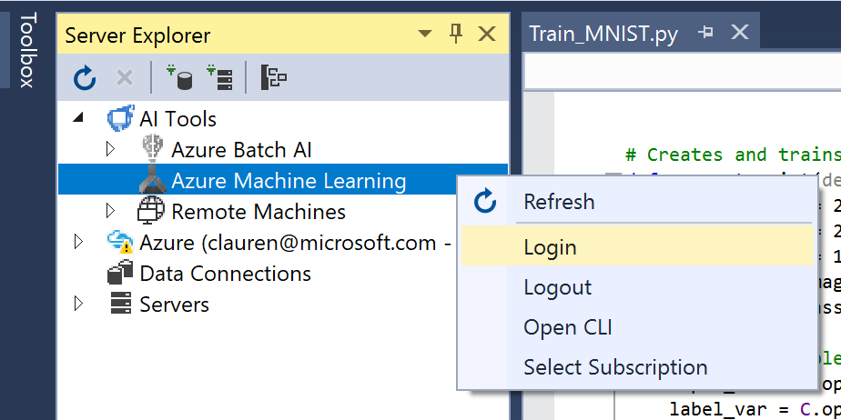
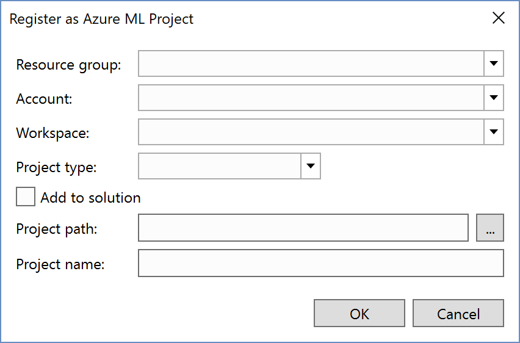
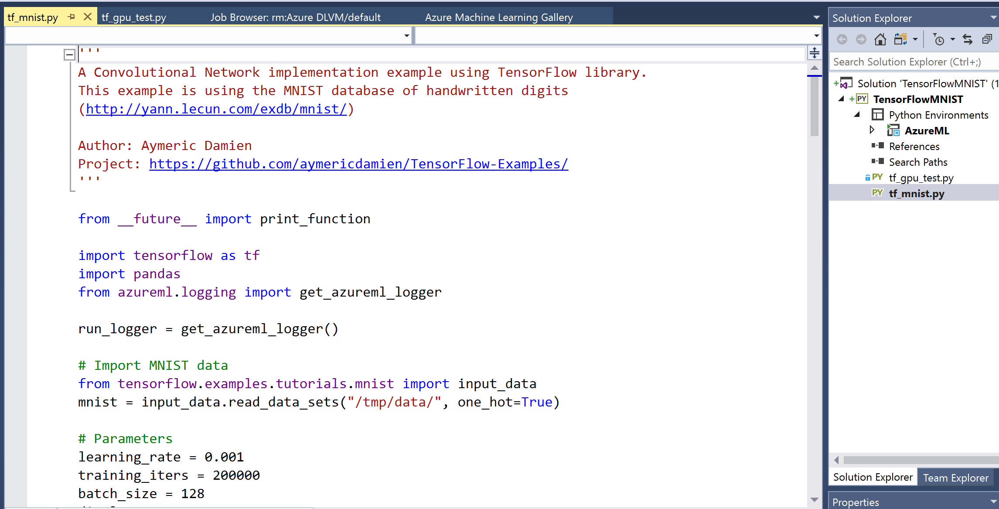
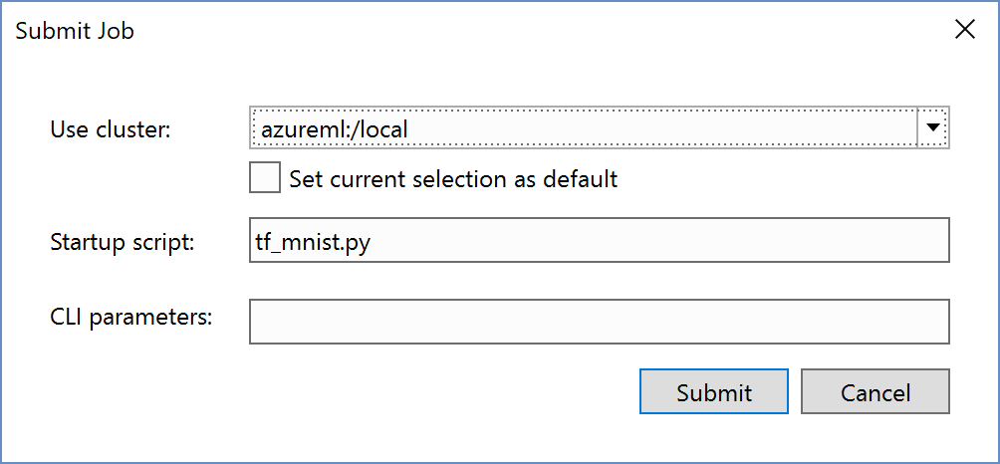

# 快速入门：在Visual Studio里从Azure Machine Learning集创建AI项目

Azure Machine Learning与Visual Studio Tools for AI相集成。 你可以通过它将机器学习任务提交到诸如Azure虚拟机，Spark集群或其它远程计算目标上。 进一步了解[Azure Machine Learning试验](https://docs.microsoft.com/en-us/azure/machine-learning/preview/experimentation-service-configuration)

在[安装Visual Studio Tools for AI](installation.md)后，能够很容易的使用Azure Machine Learning中预先配置的样例集。

> ! 必须安装Azure Machine Learning Workbench。 访问[Azure Machine Learning 安装快速入门](https://docs.microsoft.com/en-us/azure/machine-learning/preview/quickstart-installation)来进行安装。

1. 启动Visual Studio。 点击**AI Tools**菜单，并点击**Select Cluster** 来打开**服务器资源管理器**。
    
    

2. 右击服务器资源管理器中的**Azure Machine Learning**节点，登录到Azure Machine Learning订阅中，然后选择 **Login**并根据指示进行。
    
    

3. 选择**AI Tools > Azure Machine Learning Sample Gallery**。
    
    

4. 对于此快速入门，选择"**MNIST using TensorFlow**"样例，并点击click **Install**。 提供

- **Resource Group**: Azure上用来存放元数据的资源组
- **Account**: Azure Machine Learning 试验账户
- **Workspace**: Azure Machine Learning 工作区
- **Project Type**: 机器学习框架。 在这里选择**TensorFlow**
- **Add to Solution**: 确定是将它加入现有的Visual Studio解决方案，还是创建并打开一个新的解决方案
- **Project Path**: 存放代码的位置
- **Project Name**: 输入**TensorFlowMNIST**
    
    

1. Visual Studio在磁盘上会创建项目文件 (`.pyproj`) 以及其它定义在样例中的文件。 "MNIST"模板中，项目包含了几个文件。
    
    

2. 将任务提交到Azure Machine Learning。
    
    

3. 在Docker容器，本机或远程计算目标上运行
    
    