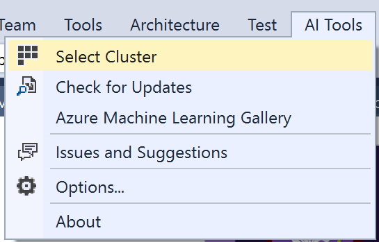
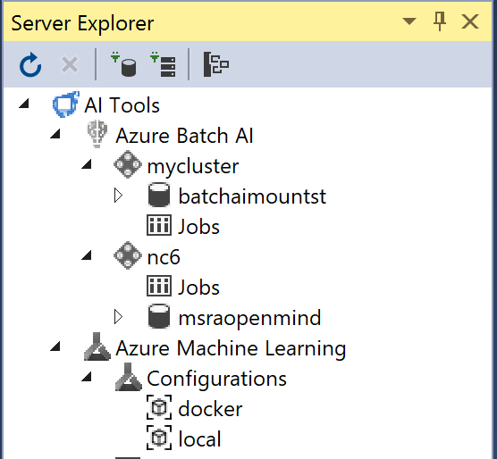
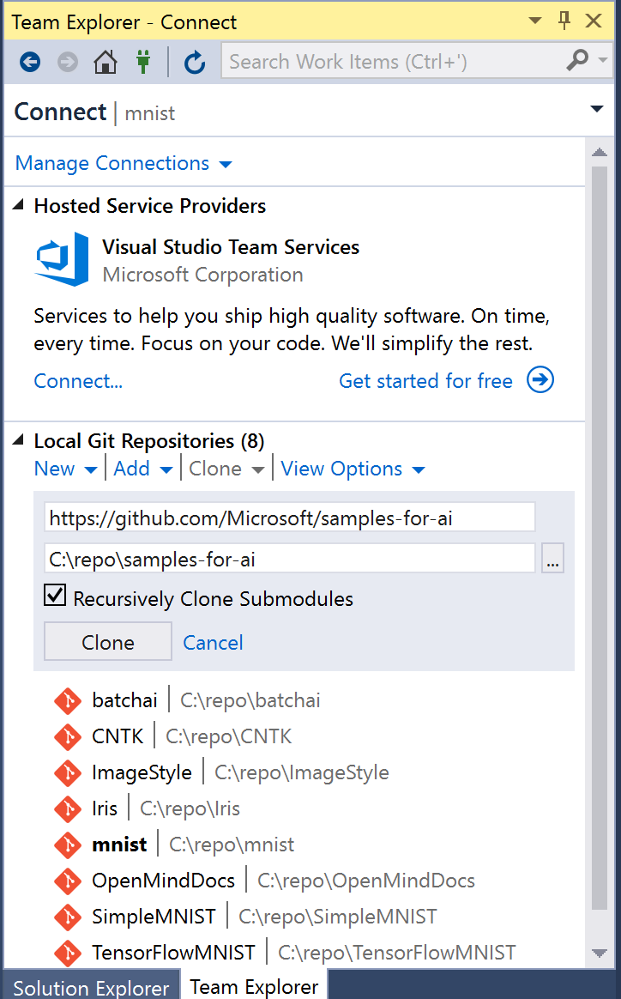
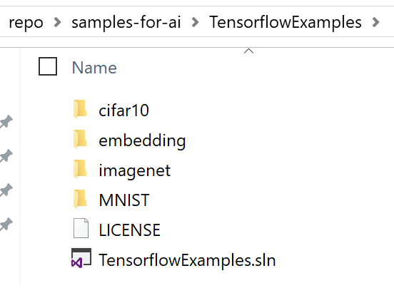
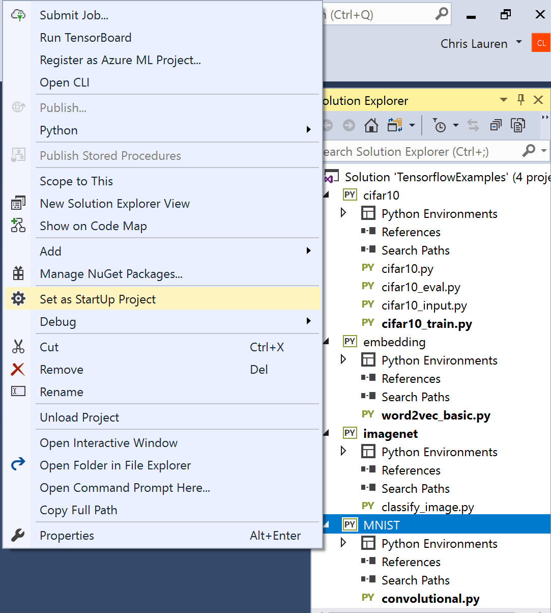
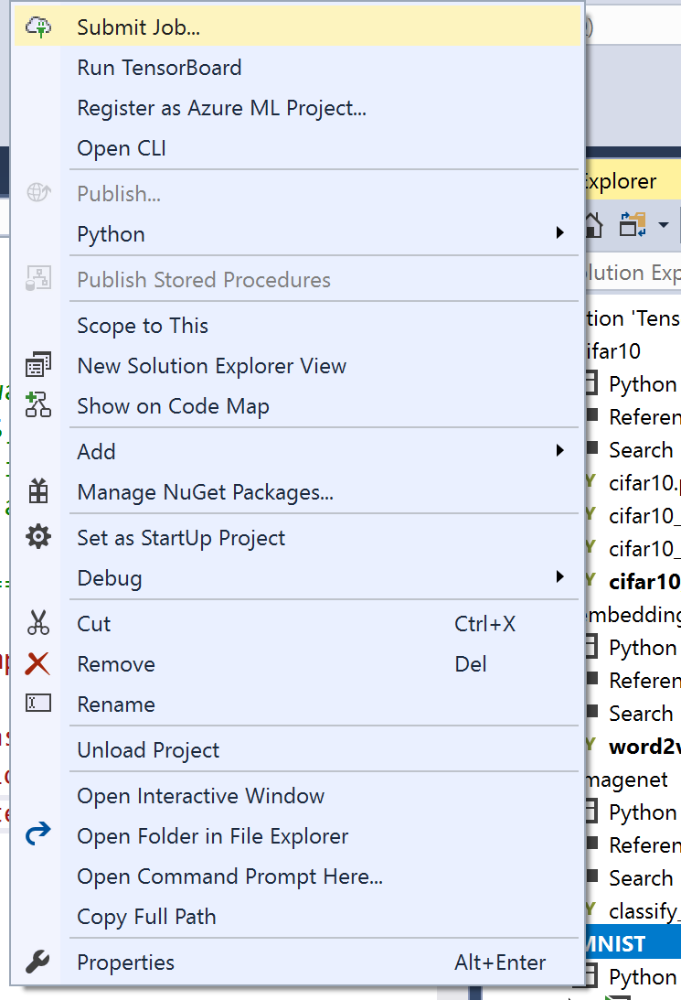
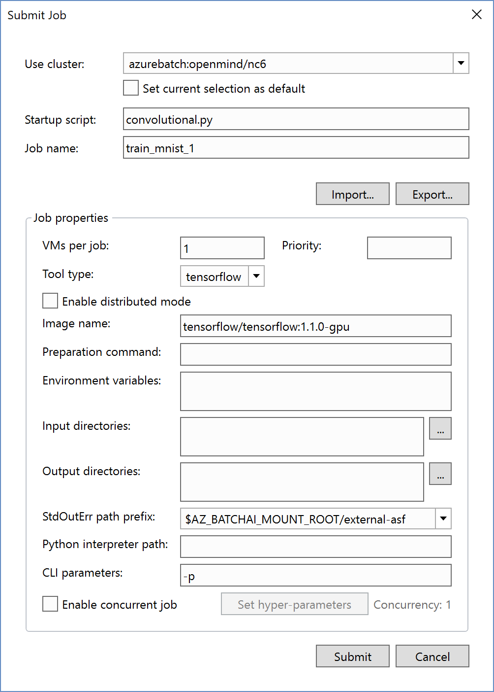

# 快速入门：在Azure Batch AI中训练AI模型

Batch AI是一个托管服务，它能让数据科学家和AI研究者在Azure虚拟机上集群上，用CPU或GPU来训练机器学习模型。 你只需要描述任务需求，以及输入输出的位置，Batch AI则会处理其它事情。 [进一步了解Azure Batch AI](https://docs.microsoft.com/en-us/azure/batch-ai/overview)

Azure Batch AI与Visual Studio Tools for AI集成在一起，因此可以在Azure中动态的扩展模型训练的资源。 在[安装Visual Studio Tools for AI](installation.md)后，能够很容易的使用Azure Machine Learning中预先配置的样例集。

1. 启动Visual Studio。 点击**AI Tools**菜单，并点击**Select Cluster** 来打开**服务器资源管理器**。
    
    

2. 展开**AI Tools**。 所有的Batch AI资源都会被自动检测并显示在服务器资源管理器中。
    
    

3. 选择 **视图 > 团队资源管理器...** 来打开 **团队资源管理器** 窗口。在这里，可以连接到GitHub，Visual Studio Team Service或者克隆代码库。
    
    

4. 在**本地Git存储库**下的URL文本框中，输入`https://github.com/Microsoft/samples-for-ai`，并输入克隆的代码目录，然后点击**克隆**。
    
    > [!提示] 在团队资源管理器中指定的目录是用来接受克隆的文件的目录。 和`git clone`命令不同的是，在团队资源管理器中克隆代码，不会自动为代码库创建一个子文件夹。

5. 克隆完成后，点击**文件 > 打开解决方案 > 项目/解决方案**
    
    

6. 在克隆的代码库中打开 **samples-for-ai\examples\tensorflow\TensorFlowExamples.sln**
    
    

7. 设置MNIST项目为**启动项目**
    
    

8. **右击 **MNIST项目**提交任务**
    
    

9. 选择**Azure Batch AI**集群，然后点击**Import**。 选择`AzureBatchAI_TF_MNIST.json`文件来快速填充一些默认值，例如，使用的Docker映像。 然后点击**Submit**
    
    