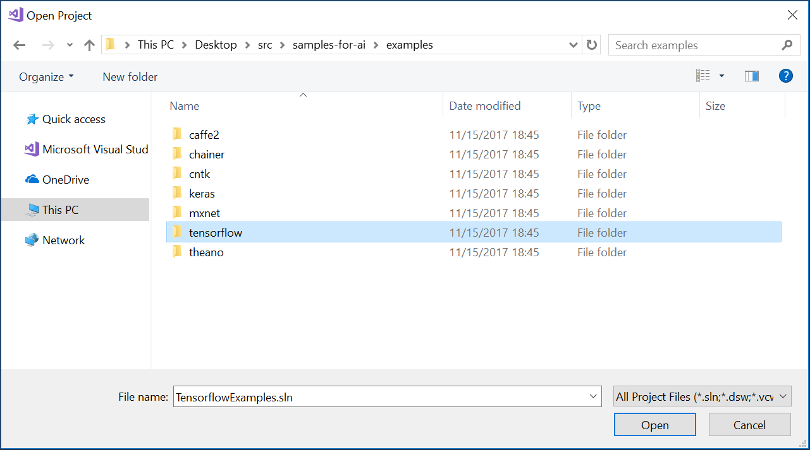
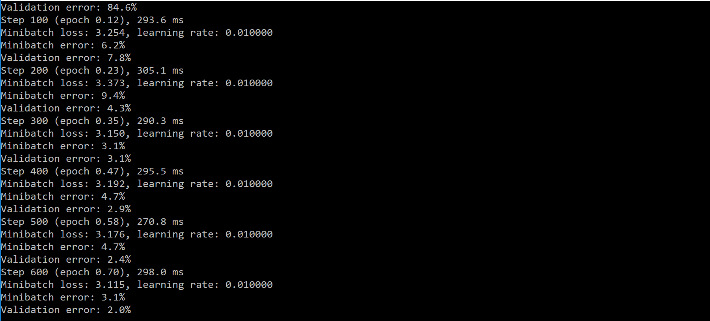

# 在本地训练TensorFlow模型

在这个快速入门中，我们会用AI Tools里的[MNIST](http://yann.lecun.com/exdb/mnist/)数据集来在本地运行TensorFlow模型。 MNIST手写体数字数据库中有60,000个样本的训练集，和10,000个样本的测试集。

## 先决条件

开始前，确保进行了如下安装：

### Google TensorFlow

在终端中运行以下命令。

```cmd
pip install tensorflow
```

如果有NVIDIA GPU

```cmd
pip install tensorflow-gpu
```

### NumPy和SciPy

在终端中运行以下命令：

```cmd
pip install numpy scipy
```

### 下载示例代码

下载[GitHub代码库](https://github.com/Microsoft/samples-for-ai)，它包含有TensorFlow，CNTK，Theano和其它深度学习库的示例。

## 打开解决方案并训练模型

- 运行Visual Studio 并选择**文件 > 打开 > 项目/解决方案**。

- 从下载的示例库中选择 **examples\tensorflow** 子目录并打开**TensorflowExamples.sln**文件。




- 在**解决方案资源管理器**中找到MNIST项目，并右击选择**设为启动项目**。

- 点击**启动**。

- 输出会打印在命令行中。



> [在云端训练TensorFlow模型](tensorflow-vm.md)